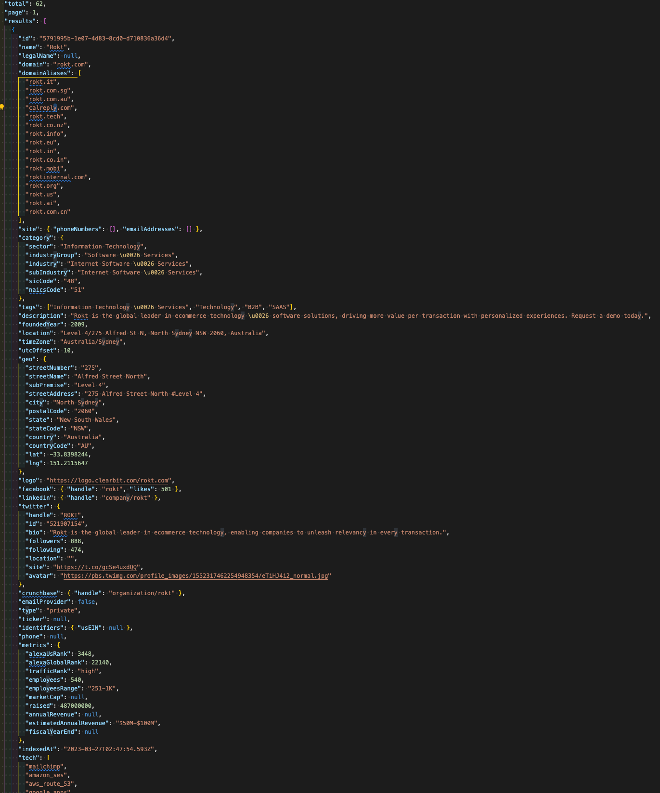

# Report

This data is a JSON object containing comprehensive information about a company called "Rokt." The data covers various aspects of the company, such as its domain, location, contact information, social media presence, and much more. Here's a summary of the key information provided in the JSON object:

### Basic Information:

- **ID**: 5791995b-1e07-4d83-8cd0-d710836a36d4
- **Name**: Rokt
- **Domain**: rokt.com
- **Domain Aliases**: rokt.it, rokt.com.sg, rokt.com.au, and more.
- **Founded Year**: 2009
- **Company Description**: Rokt is the global leader in e-commerce technology & software solutions, driving more value per transaction with personalized experiences.

### Company Location:

Level 4/275 Alfred St N, North Sydney NSW 2060, Australia

### Company Category:

- **Sector**: Information Technology
- **Industry Group**: Software & Services
- **Industry**: Internet Software & Services
- **Sub-Industry**: Internet Software & Services
- **SIC Code**: 48
- **NAICS Code**: 51
- **Tags**: Information Technology & Services, Technology, B2B, SAAS

### Social Media Presence:

- **Facebook**: handle - rokt, likes - 501
- **LinkedIn**: handle - company/rokt
- **Twitter**: handle - ROKT, followers - 888, following - 474

### Metrics:

**Alexa US Rank**: 3448
**Alexa Global Rank**: 22140
**Traffic Rank**: high
**Employees**: 540
**Raised**: $487,000,000
**Estimated Annual Revenue**: $50M-$100M
**Technologies used by the company**:

Mailchimp, Amazon SES, AWS Route 53, Google Apps, and many more.

### Tech Categories### :

Email delivery service, DNS, Productivity, Marketing automation, and others.
This JSON object can be used to gain insights into the company's profile, location, size, and technological stack.